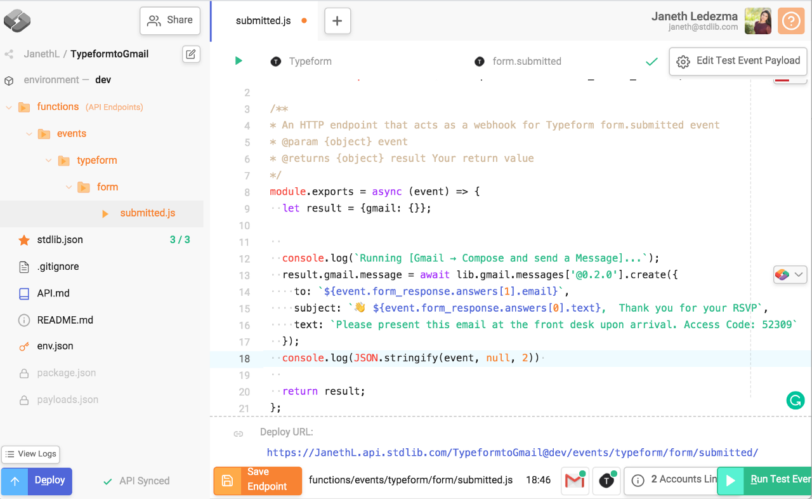

# README

# Connect Typeform to Gmail and Send Automated Emails with Autocode

Ever wanted to send a custom, automated e-mail based on a Typeform or other survey response - like an RSVP? Look no further, we can do this with Autocode in only a couple of minutes.
In this guide, we will connect Typeform to Gmail to send automated emails when a new form is submitted. 

---

## Use-cases:
Create registration forms for events and send automated emails with event details or event access codes
Build referral forms and automatically send emails to new prospects
Create Newsletter sign up forms - collect email addresses and automatically send your most recent update in an automated email
Build online quotes with Typeform and send quotes in an automated email

---

## What You'll Need Beforehand
- 1x Typeform account
- 1x Gmail account
- 1x Standard Library account

---
## Step 1: Prepare your Registration Form

Head over to Typeform to create your registration form.

Typeform is one of my favorite tools to use when creating surveys and forms. It is easy to use with handy templates and options to create custom forms.

Once you've signed up or logged in, select "New Typeform" from the dashboard. Find and select the "Start from scratch" button.

For now, let's set up a quick form with a welcome screen and two questions that ask for a person's name and email.

You can return at any time to add images and questions.
Select the Publish button on the upper right corner. Your form is now live and ready to gather emails! You can find the URL to your published form by selecting the share tab located in the top middle of the page.

---

## Step 2: Deploy Typeform to Gmail project from Github

Next fork the code by clicking this button:

Sign in or create a free account. If you have a Standard Library account, click Already Registered and sign in using your Standard Library credentials.

Give your project a unique name and select Start API Project from Github:

Autocode automatically sets up a project scaffold to save your project as an API endpoint.

Navigate through the `functions/events/typeform/form` folders on the left and select `submitted.js` file.

---

## Step 3: Link Gmail and Typeform Accounts

Next, you'll need to link Typeform and Gmail accounts to an identity Token on Standard Library. Select the "2 Accounts Required" button.

Standard Library provides Identity Tokens that securely store and manage credentials to third party APIs. Once you've linked your accounts to a Token, you'll be able to listen for events and access your APIs resources with that token.

Proceed to Link Resources. If this is your first time linking Typeform to Gmail accounts click the Link New Resource button and follow the instructions to Link each account.

For Gmail follow the instructions to enable the Gmail API.

Select the Enable Gmail API button. Select Web Server in the top menu of the dialog that appears, and paste your URI into the Authorized redirect URIs input in the dialog. Select create.

After enabling the Gmail API in Step 1, copy your Client ID and Client Secret, paste them in the inputs in Autocode in Step 2, then press Next Step to continue.

Click Advanced and then Go to stdlib.com to finish the linking process.

In the auth flow, confirm the Gmail account you'd like to link and select Allow.

Proceed to link your Typeform account.
You will go through another authentication flow to link your Standard Library token to your Typeform account.

You'll be presented with a list of all your forms on Typeform. Find and Select your Typeform for this tutorial and click Finish.

Once complete, you should see green checkmarks indicating that you've successfully linked both of your accounts. Select Finish Linking.

---

## Step 4: Test your Typeform to Gmail Integration

Now that you've linked your accounts to a Standard Library token for this workflow, you can test your Typeform to Gmail integration. 

Notice that the `event` parameter on line 8 `module.exports` is passing in information from a full event payload on Typeform. You can see and edit a sample of an event by clicking the `Edit Test Event` Payload button on the upper-right side of the screen.

Give your sample payload a test name on line 9 and your email on line 18. The email will be receiving the test automated message. Select Save Payload.

Select the Run Test Event button to simulate a form.submitted event on Typeform and trigger your workflow, including the lib.gmail.messages.create API on Standard Library

Check your inbox. You should see the automated email.

Notice that on line 14 and line 15, we are using dot (.) notation to extract email and text from the test event payload and set them as parameters in our request to our Gmail API.

You can replace the text that reads `<Your subject headline here!>` with your custom headline and `<Type your email message here>` with your custom message and select Run Test Event. 

## Step 5: Deploy your Project

Once you've finished customizing the subject headline and body to your liking select the orange Save Endpoint and the blue Deploy button to deploy your workflow to the cloud.

Congrats! You've successfully navigated Autocode to ship a Typeform to Gmail API integration.

You can test your integration by submitting your form on Typeform. If you've set everything up correctly you will receive an automated email shortly after submitting your Typeform.

---

## Logs

Autocode comes complete with logs to help us iterate on and debug our projects. For example, if we want to view a full event payload to extract and pass more information from Typeform to Gmail, we can add the following line of code:

`console.log(JSON.stringify(event, null, 2))`

Click "Save Endpoint" and Deploy your code.

Now return to Typeform and submit a form.

Find and click the "View Logs" button above the "Deploy" button.

Your projects log will open up in a new screen. You will see the full event payload like this one:

That's it! 🤗

Thank you for taking the time to read and try this out! If you'd like to connect Typeform and Gmail to any other tools, please reach out to the team at Standard Library.

